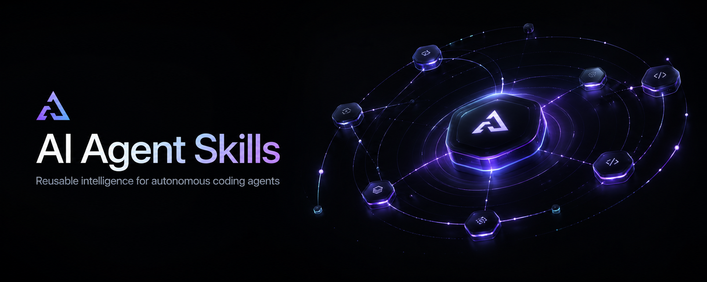

<p align="center">
  
</p>

<p align="center">
  <a href="https://opensource.org/licenses/MIT"></a>
  <a href="#-skills"></a>
  <a href="https://claude.ai/code"></a>
  <a href="marketplace.json"></a>
  <a href="https://github.com/JohnWayneeee"></a>
  <a href="https://casely.digital/"></a>
</p>

<p align="center">
  A curated catalog of reusable skills by <a href="https://github.com/JohnWayneeee">@JohnWayneeee</a> — each one a self-contained prompt you plug into Claude Code, Codex, or any compatible agent runtime and invoke by name.
  <br/>
  <strong>No configuration. No boilerplate. Just pick a skill and go.</strong>
</p>

---

## 💡 Why Agent Skills?

Most AI agents know everything and do nothing well.

Skills fix that. Each one gives your agent a focused role, a clear process, and opinionated defaults — so instead of writing a 500-word prompt every time, you invoke a name and get expert-level output.

| Benefit | What it means |
|---------|--------------|
| ✅ **Consistent results** | Same inputs, same quality, every time |
| 👥 **Team-ready** | Share a skill folder and everyone's agent behaves the same way |
| 🔗 **Composable** | Chain skills together for multi-step workflows |
| 🚀 **Production-tested** | Built and validated on a real product, not theoretical |

---

## 🛠 Skills

| Skill | Category | What it does |
|-------|----------|-------------|
| [ui-final-polish](skills/ui-final-polish/) | `design` | Tighten spacing, hierarchy, and visual rhythm on an existing UI — without redesigning it |
| [react-flow-best-practices](skills/react-flow-best-practices/) | `development` | Build `@xyflow/react` v12 canvases and custom nodes the right way |
| [payoff-action-modeling](skills/payoff-action-modeling/) | `design` | Model post-outcome UI actions from user intent — turns "what happens next?" into a decision tree |
| [browser-audit](skills/browser-audit/) | `quality` | Pre-deploy accessibility, SEO, and Lighthouse audit with actionable findings |
| [workflow-node-setup](skills/workflow-node-setup/) | `development` | Configure and debug React Flow workflow nodes without the usual trial-and-error |
| [pencil-to-code](skills/pencil-to-code/) | `design` | Convert Pencil `.pen` wireframes into production-ready frontend code |
| [figma-pencil-fsd-tailwind4](skills/figma-pencil-fsd-tailwind4/) | `design` | Translate Figma or Pencil designs into FSD + Tailwind 4 code — framework-agnostic, with RSC, tokens, and a11y guardrails |

---

## 📦 Install

### Via Claude Code marketplace (recommended)

```bash
/plugin marketplace add JohnWayneeee/ai-agent-skills
/plugin install ui-final-polish@ai-agent-skills
```

Replace `ui-final-polish` with any skill name from the table above.

### Manual — copy into your project

```
your-project/
└── .agents/
    └── skills/
        └── ui-final-polish/
            └── SKILL.md
```

Or into your personal skills directory:

```
~/.claude/skills/ui-final-polish/
```

### Invoke a skill

```
Use $ui-final-polish to improve the spacing and hierarchy on this card component.
```

---

## 🗂 Skill Structure

<details>
<summary>Every skill follows the same layout — click to expand</summary>

```
skills/<skill-name>/
├── SKILL.md          # Start here — the full instruction set
├── agents/
│   └── openai.yaml   # Optional: display name and default prompt
└── references/
    └── *.md          # Optional: checklists, criteria, reference docs
```

The `marketplace.json` in the repo root enables the `/plugin marketplace add` install flow.

</details>

---

## 📋 Skill Details

<details>
<summary><strong>ui-final-polish</strong> — Final visual polish without redesign</summary>

**Category:** Design
**Use when:** Structure is done, but spacing, hierarchy, or rhythm feel off.

Applies a systematic pass over an existing UI component or page — fixing alignment, type scale, colour contrast, and white space — without changing layout or functionality.

[→ View skill](skills/ui-final-polish/)

</details>

<details>
<summary><strong>react-flow-best-practices</strong> — @xyflow/react v12 patterns</summary>

**Category:** Development
**Use when:** Building or debugging a React Flow canvas, custom nodes, or edge routing.

Covers node registration, handle placement, custom node types, viewport management, and performance patterns for `@xyflow/react` v12.

[→ View skill](skills/react-flow-best-practices/)

</details>

<details>
<summary><strong>payoff-action-modeling</strong> — Post-outcome UI decisions</summary>

**Category:** Design
**Use when:** Deciding what UI actions to show after a user completes a key step.

Models the decision tree for post-outcome actions — placement, scope, urgency, and copy — based on what the user was trying to achieve.

[→ View skill](skills/payoff-action-modeling/)

</details>

<details>
<summary><strong>browser-audit</strong> — Pre-deploy quality check</summary>

**Category:** Quality
**Use when:** Before deploying any page to production.

Runs a structured audit covering accessibility (WCAG), SEO meta, Core Web Vitals readiness, and Lighthouse score targets — returning prioritised findings.

[→ View skill](skills/browser-audit/)

</details>

<details>
<summary><strong>workflow-node-setup</strong> — React Flow node configuration</summary>

**Category:** Development
**Use when:** A workflow node isn't connecting, resizing, or rendering correctly.

Covers handle registration, resize observer setup, drag-and-drop wiring, and markdown output rendering inside React Flow nodes.

[→ View skill](skills/workflow-node-setup/)

</details>

<details>
<summary><strong>pencil-to-code</strong> — Wireframe to production code</summary>

**Category:** Design
**Use when:** You have a Pencil `.pen` design and need production frontend code.

Reads Pencil design files and generates layout, typography, spacing, and component structure faithful to the original wireframe.

[→ View skill](skills/pencil-to-code/)

</details>

<details>
<summary><strong>figma-pencil-fsd-tailwind4</strong> — Design to FSD + Tailwind 4 code</summary>

**Category:** Design
**Use when:** Translating a Figma frame or Pencil `.pen` design into production code that respects Feature-Sliced Design boundaries and Tailwind v4 token conventions.

Framework-agnostic. Decomposes a design into `shared` / `entities` / `features` / `widgets` / `pages` / `app-shell` / `app` layers, reconciles design variables with semantic tokens, enforces Server/Client boundaries when the host framework has RSC, and validates against an accessibility checklist. Comes with 8 reference files covering FSD mapping, RSC boundaries, Tailwind v4 tokens, Figma MCP workflow, Pencil workflow, a11y, project contracts, and a worked frame-to-code example.

[→ View skill](skills/figma-pencil-fsd-tailwind4/)

</details>

---

## ⭐ Star History

[](https://star-history.com/#JohnWayneeee/ai-agent-skills&Date)

---

## 🏗 Built alongside a real product

These skills were developed while building **[Casely](https://casely.digital/)** — an AI-powered workflow and QA tool. They are production-tested, not theoretical.

[](https://casely.digital/)

---

## 📄 License

MIT — see [LICENSE](LICENSE).

---

Made with ❤️ by [@JohnWayneeee](https://github.com/JohnWayneeee)
